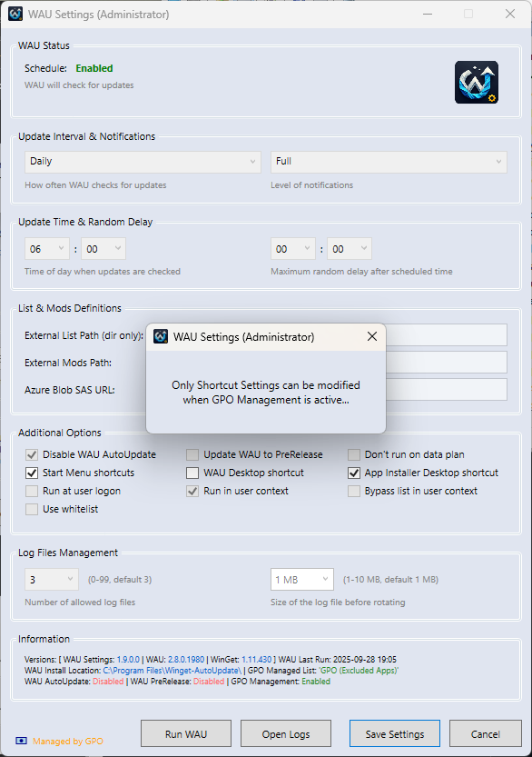

<br><br>

# WAU Settings GUI (for Winget-AutoUpdate)

Provides a user-friendly portable standalone interface to modify every aspect of Winget-AutoUpdate (**WAU**) settings

### Dependencies
This project depends on the following repository:
- [Winget-AutoUpdate](https://github.com/Romanitho/Winget-AutoUpdate): has all the settings this project can handle/modify/save/restore/share and document.

If **WAU** is not installed, the GUI prompts at startup to download and install it with standard settings.

---

### Description
Significantly enhance **WAU's** usability for home admin users while maintaining enterprise-grade functionality.<br>
Benefits from not having to manage the settings in several places when testing etc. (great for developers)...

...a perfect companion for those supporting the community (if the community actually uses it!) - being able to ask for a screenshot of the settings because it comes with all included (even a screenshot function masking potentially sensitive data)!

Configure **WAU** settings after installation, including:
- Update intervals and timing
- Notification levels
- Configuring list and mods paths
- Additional options like running at logon, user context, etc.
- Creating/deleting shortcuts
- Managing log files
- Starting WAU manually
- Screenshot with masking functionality for documentation
- GPO management integration
- Real-time status information display showing version details, last run times, and current configuration state
- Developer tools for advanced troubleshooting:
  - Task scheduler access
  - Registry editor access
  - GUID path exploration
  - WinGet system wide installed application list
  - List file management
  - MSI transform creation (using current showing configuration)
  - Configuration backup/import (i.e. for sharing settings)
  - Uninstall/install **WAU** (with current showing configuration)
  - Manual/automatic check for updates (checks automatically every week as standard, can be managed via `config_user.psm1`)
  - Direct access to the **WAU Settings GUI** install folder

NB: Must be run as **Administrator** (exe and shortcuts have the flag set)

### Automatic Installation
- Use **WinGet CLI** from **Command Prompt** to install the latest released **WinGet** version:
  
  ```bash
  winget install KnifMelti.WAU-Settings-GUI --scope user
  ```

This will install a **Portable WinGet Package** (with alias: **WAU-Settings-GUI**) to:
  
   `%USERPROFILE%\AppData\Local\Microsoft\WinGet\Packages\KnifMelti.WAU-Settings-GUI_Microsoft.Winget.Source_8wekyb3d8bbwe`.

### Manual Installation
- Download and extract `Sources\WAU Settings GUI`
- Standalone Installer/Portable (i.e. no need to install)
- Detects if running from USB drive, etc.
- Run `WAU-Settings-GUI.exe`:
  - 
  - Select a base directory for the installation or run directly in portable mode

### Running
- After installation, **WAU Settings GUI** starts (if installed by `WinGet` you must start it via an ordinary **Command Prompt** using the `PortableCommandAlias` from `WinGet`: **WAU-Settings-GUI**)
- If **WAU** is not installed, it will prompt to download and install with standard settings
- If a local list is not found, it will prompt to create a new one
- In the GUI you now have **☐|☑ Start Menu shortcuts** / **☐|☑ WAU Desktop shortcut** / **☐|☑ App Installer shortcut** options showing the current installed **WAU** configuration
- Configure every setting to your preferences and `Save Settings`
- The **WAU Settings (Administrator)** shortcut has now been created under **Start Menu\Programs\Winget-AutoUpdate** folder (along with the other **WAU** shortcuts) or on your own **Desktop** (pin to taskbar when running maybe?) depending on your choice
- In `config_user.psm1` you can set the `AUTOUPDATE_CHECK` variable to `$true/$false` to enable/disable version autoupdate check once every `AUTOUPDATE_DAYS` and other user-specific settings (i.e. colors)
- Copy/move `config_user.psm1` to the `modules` folder to enable it

### Updating
- Dev Tools (F12): Click the button `[ver]`
- Checks automatically every week as standard (can be managed via `config_user.psm1`)
- If an update exists, **WAU Settings GUI** will ask if you want to download and install the new version
- Before installing a backup of the current version will be created in `ver\backup` folder

- **WAU** will also update in user scope with every new released **WinGet** version of **WAU Settings GUI** 
  - To avoid failed updates you can create a **KnifMelti.WAU-Settings-GUI-preinstall.ps1** script in the **WAU** `mods` folder to shut down **WAU Settings GUI** before updating (open files) or not run it when updating:
  ```powershell
  Get-Process powershell | Where-Object {$_.MainWindowTitle -like "WAU Settings*"} | Stop-Process -Force
  ```
  - Or disable the **WAU** updating via your `excluded_apps.txt`:<br>```KnifMelti.WAU-Settings-GUI```
- Alternatively, you can use **WinGet CLI** from **Command Prompt** updating to every new release of **WinGet** version of **WAU Settings GUI**:
  
  ```bash
  winget upgrade KnifMelti.WAU-Settings-GUI --scope user
  ```


### Uninstallation
- Use **Programs and Features** in **Control Panel** to uninstall **KnifMelti WAU Settings GUI**
- Uninstall can be done from `CMD` too (`/UNINSTALL` or `/UNINSTALL /S` parameter) using `UnInst.exe` in the **WAU Settings GUI** install folder, e.g.:
  
  ```bash
  "C:\WAU Settings GUI\UnInst.exe" /UNINSTALL /S
  ```
- This will remove even the `WinGet` Portable package from the source, so it will not show up in the `WinGet` list anymore
- **WAU** will be automatically reinstalled afterward restoring the original current showing shortcuts.

### Screenshots
Managed by Registry (local):  


Dev Tools (F12):  


Managed by GPO (central/local):  


Portable Mode:  


