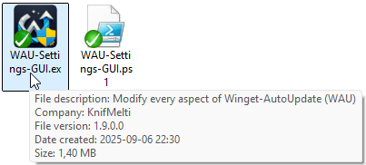
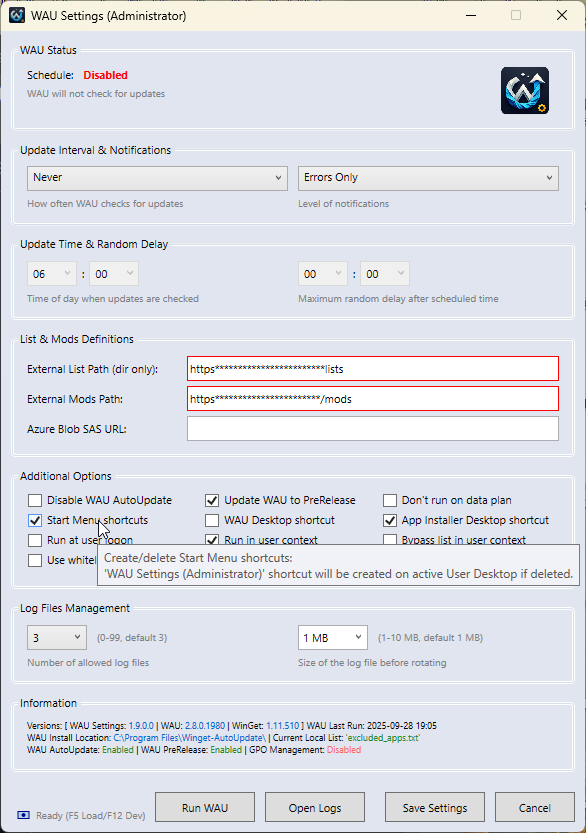
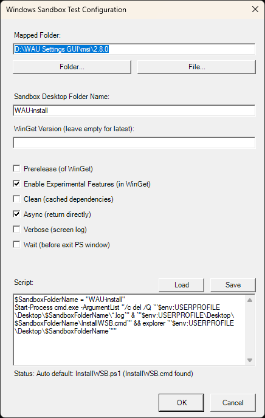

<br><br>

# WAU Settings GUI (for Winget-AutoUpdate)

Provides a user-friendly portable standalone interface to modify every aspect of Winget-AutoUpdate (**WAU**)

### Dependencies
This project depends on the following repository:
- [Winget-AutoUpdate](https://github.com/Romanitho/Winget-AutoUpdate): has all the settings this project can handle/modify/save/restore/share and document

If **WAU** is not installed, it will prompt to download and install with standard settings.

---

### Description
Significantly enhance **WAU's** usability for home admin users while maintaining enterprise-grade functionality.<br>
Benefits from not having to manage the settings in several places when testing etc. (great for developers)...

...a perfect companion for those supporting the community (if the community actually uses it!) - being able to ask for a screenshot of the settings because it comes with all included (even a screenshot function masking potentially sensitive data)!

#### Configure **[WAU settings](#managed-by-registry-local)** after installation
- Update intervals and timing
- Notification levels
- Set list and mods paths
- Additional options like running at logon, user context, etc.
- Creating/deleting shortcuts
- Managing log files
- Starting **WAU** manually
- **Screenshot** with masking functionality for documentation (**F11**)
- **[GPO Management](#managed-by-gpo-centrallocal)** integration
- **Status** information display showing version details, last run times, and current configuration state (**F5 to refresh**)
- **[Dev Tools](#dev-tools-f12)** for advanced troubleshooting (**F12/click on logo**, **double-click** for **WAU Settings GUI** on **GitHub**):
  - `[manifests/issues/errors]` Useful **WinGet** links
  - `[gpo]` Open **WAU policies path** in registry (if **GPO Managed**)
  - `[tsk]` **Task scheduler** access (look in **WAU** subfolder)
  - `[reg]` Open **WAU settings path** in registry
  - `[uid]` **GUID** path exploration (regarding **WAU MSI** installation)
  - `[sys]` Open **WinGet** system wide installed application list (if previously saved by **WAU**)
  - `[mod]` Open the external **WAU** mods folder
  - `[lst]` Open the **current local list**
  - `[usr]` **Change colors/update schedule** for **WAU Settings GUI**
  - `[msi]` **MSI** transform creation (using current showing configuration)
  - `[wsb]` **[Windows Sandbox (WSB)](https://github.com/KnifMelti/WAU-Settings-GUI?tab=readme-ov-file#sandboxtest)** installation/test of **WAU** installation
    - A standalone **SandboxTest** shortcut for running advanced tests is created in **User Start Menu** the first time `[wsb]` is used with **WSB** installed
  - `[cfg]` **Configuration** backup/import (i.e. for sharing settings)
  - `[wau]` Reinstall **WAU** (with current showing configuration)
    - Stores source in `[INSTALLDIR]\msi\[VERSION]` (enables **WAU** `Repair` in **Programs and Features**)
  - `[ver]` Manual check for **WAU Settings GUI updates** (checks automatically every week as standard)
    - If manual check and `[INSTALLDIR]\ver\backup` exists a **restore** option is also presented
  - `[src]` Direct access to **WAU Settings GUI** `[INSTALLDIR]` 

#### Nota bene
- Must be executed as **Administrator** (**EXE** and shortcuts have the flag set)
- **EXE** is signed with **[KnifMelti Certificate](#-knifmelti-certificate)**

### Manual installation
- Download, unblock and extract the latest release: [WAU-Settings-GUI-vX.X.X.X.zip](https://github.com/KnifMelti/WAU-Settings-GUI/releases/latest)
- Run **[WAU-Settings-GUI.exe](#manual-installation-portableinstaller)** (Portable/Installer):
  - Detects if running from **USB** drive (then automatically executes as **Portable**)
  - Select a base directory for the `[INSTALLDIR]` or run directly in portable mode

### Automatic installation
- Use **WinGet CLI** from **Command Prompt** to install the latest released **WinGet** version:
  ```bash
  winget install KnifMelti.WAU-Settings-GUI #(--scope user, if failing)
  ```
- This will install a **Portable WinGet Package** (with `PortableCommandAlias`: **WAU-Settings-GUI**) to:
   `%USERPROFILE%\AppData\Local\Microsoft\WinGet\Packages\KnifMelti.WAU-Settings-GUI_Microsoft.Winget.Source_8wekyb3d8bbwe`
- Elevation needed if dependencies missing:
  ```bash
  Dependencies:
    - Package Dependencies:
        Romanitho.Winget-AutoUpdate
  ```

### Running
- After installation, **WAU Settings GUI** starts (if installed by **WinGet** you must start it via an ordinary **Command Prompt** using the `PortableCommandAlias`: **WAU-Settings-GUI**)
- If **WAU** is not installed and this is a manual installation, a prompt to download and install it with standard settings will pop up
- If a local list is not found, it will prompt to create a new `excluded_apps.txt`
  - The created list will contain `KnifMelti.WAU-Settings-GUI`
- In the **[GUI](#managed-by-registry-local)** you now have **☐|☑ Start Menu shortcuts** / **☐|☑ WAU Desktop shortcut** / **☐|☑ App Installer shortcut** options showing the current installed **WAU** configuration
- Configure every setting to your preferences and `Save Settings`
- The **WAU Settings (Administrator)** shortcut has now been created under **Start Menu\Programs\Winget-AutoUpdate** folder (along with the other **WAU** shortcuts) or on your own **Desktop** (pin to taskbar when running maybe?) depending on your choice
- If **WAU** is updated and some shortcut icons goes missing, you'll have to toggle the **☐|☑ Start Menu shortcuts** / **☐|☑ WAU Desktop shortcut** / **☐|☑ App Installer shortcut** options again (and save in between) to create new shortcuts so that they are updated to the new **WAU** version icon

### Updating
- Checks automatically every week as standard (click the button `[usr]` under Dev Tools (**F12**) to change the update schedule)
- Dev Tools (**F12**): Click the button `[ver]`
  - If `[INSTALLDIR]\ver\backup` exists a restore option is also presented
- If an update exists, **WAU Settings GUI** will ask if you want to download and install the new version
- Before updating a backup of the current version will be created in `[INSTALLDIR]\ver\backup` folder
  - After update/restore the local **WinGet** version in registry is synced with the current version of `WAU-Settings-GUI.exe`
- **WAU** will also rudimentary update **WAU Settings GUI** in user scope with every new released **WinGet** version
  - To avoid failed updates (locked/open files) you can:
    - Create a `KnifMelti.WAU-Settings-GUI-preinstall.ps1` script in the **WAU** `mods` folder to shut down **WAU Settings GUI** before updating (or not run it when updating):
      ```powershell
      Get-Process powershell | Where-Object {$_.MainWindowTitle -like "WAU Settings*"} | Stop-Process -Force
      ```
    - Disable the **WAU** updating alltogether via your `excluded_apps.txt`:<br>`KnifMelti.WAU-Settings-GUI`
- Alternatively, you can use **WinGet CLI** from **Command Prompt** to rudimentary update to every new released **WinGet** version of **WAU Settings GUI**:
  ```bash
  winget upgrade KnifMelti.WAU-Settings-GUI #(--scope user, if failing)
  ```
- The built-in updater is absolutely the preferred option, making a backup of your current installed version first and taking care of locked/open files
  - A repair is automatically performed if files are corrupted/missing when starting

### SandboxTest
- **Microsoft** developed a script for prepping and starting a **Windows Sandbox (WSB)** environment for installing/validating local **WinGet** manifests:
  - https://github.com/microsoft/winget-pkgs/blob/master/doc/README.md#in-windows-sandbox
  - Sandbox requirements: Windows 10/11 Pro/Enterprise/Education (Win10: version 1903+)/Virtualization enabled in BIOS (Intel VT-x or AMD-V)/Minimum 4 GB RAM, 2 CPU cores
- Now incorporated (heavily modified) in **WAU Settings GUI** for testing the installation of **WAU** (with generated transform) and be able to fully test **WinGet** installations/updates via **WAU** in the virtual environment
- A standalone **[SandboxTest](#sandboxtest-1)** shortcut is also created in the user **Start Menu** (the first time `[wsb]` is used with **WSB** installed) for more advanced testing, including recognition of files in the selected folder
- A **Script Mapping Configuration** in `wsb\script-mappings.txt` determines what is chosen
  - 4 predefined scripts are included (create your own and save/load) chosen by recognition:
      - **InstallWSB**: if the chosen folder contains files created from `[wsb]`
      - **WinGetManifest**: if the chosen folder contains **WinGet** manifests
      - **Installer**: if the chosen folder contains `install.*`
      - **Explorer**: a general script opening the selected mapped folder in **WSB**
- A file browser for specifically selecting the file to run is also included
- The preconfigured **[Windows Sandbox (WSB)](#wsb)** started is in my opinion a really good platform with downloadable tools for quick testing a lot as a developer

### Uninstallation
- Use **[Programs and Features](#uninstallation-1)** in **Control Panel** to uninstall **KnifMelti WAU Settings GUI**
- Uninstall can be done from `CMD` too (`/UNINSTALL` or silent `/UNINSTALL /S` parameter) using `UnInst.exe` in the **WAU Settings GUI** `[INSTALLDIR]`:
  ```bash
  #e.g.:
  "C:\WAU Settings GUI\UnInst.exe" /UNINSTALL
  #i.e.:
  "%USERPROFILE%\AppData\Local\Microsoft\WinGet\Packages\KnifMelti.WAU-Settings-GUI_Microsoft.Winget.Source_8wekyb3d8bbwe\UnInst.exe" /UNINSTALL /S
  ```
- This will remove everything, including the **Portable WinGet Package** from the source (it will not show up in the **WinGet** installed list anymore)
- **WAU** will be automatically reinstalled afterward restoring the current showing configuration
  - Stores source in `%ProgramData%\Package Cache\[GUID][LONGVERSION]` (enables **WAU** `Repair` in **Programs and Features**)

---

### Screenshots
#### 🔒 KnifMelti Certificate

#### Manual installation (Portable/Installer)
<br>

#### Managed by Registry (local)

#### Dev Tools (F12)

#### Managed by GPO (central/local)

#### SandboxTest

#### WSB

#### Uninstallation


---
<p align="center">
  <a href="https://github.com/KnifMelti/WAU-Settings-GUI/wiki/KnifMelti-Brand" title="KnifMelti Brand">
    
  </a>
</p>
